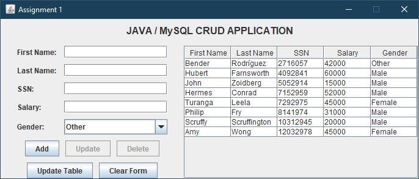

# Distributed Systems 1 - Assignment 1 (10%)

**Due Date:** Sunday, October 25th, 2020 (11:59pm)

**Result:** Pending

## Requirements

Create CRUD Application using Java, JDBC and MySQL.

---

## Environment

-   **Java:** Oracle JDK 1.8.0_261
-   **MySQL Connector:** 8.0.21
-   **Eclipse:** 2019-09
-   **Main Class:** Assignment1.java

## Default MySQL login details

MySQL connection details are configured in the _MySQLHandler_ class

-   **Username:** root
-   **Password:** _<blank>_
-   **Host:** localhost
-   **Port:** 3306
-   **Database:** test
-   **Table:** employees

## Notes

-   Two SQL files are included, one is just a standard export from phpMyAdmin, the other will create a database called test (or use the existing database if one already exists), drop any tables called “employees” and create a new table called “employees”. Sample data is included in both files.
-   SSN cannot be updated in the GUI. This is intentional as it is used as the unique identifier for each employee and in a real system, this value would not change.

## GUI

### Buttons

-   Add – Add a new employee to the database (Create)
-   Update – Update the details for an existing user (Update)
-   Delete – Delete the selected user (Delete)
-   Update Table – Manually refresh the data in the table (Read)
-   Clear Form – Clears all text fields, clears any selected items in the table
